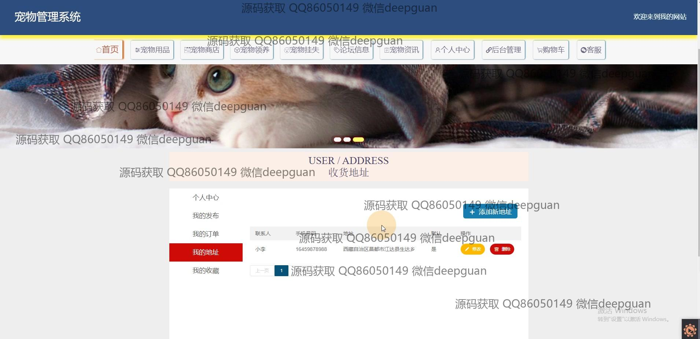

<h1 align="center">的宠物商店领养管理系统vue</h1>

## 简介
宠物商店领养管理系统：功能包括管理员和用户角色管理、宠物资讯发布、宠物领养和挂失管理，支持商品分类与信息录入，综合论坛和订单处理功能。    --计算机毕业设计源码；毕设源码；java毕业设计源码

## 联系方式

<h3 align="center">获取完整代码与数据库文件 + 微信：deepguan QQ: 86050149 QQ群: 783742310</h3>

<h3 align="center">可帮忙远程部署 包运行成功！提供远程部署、修改代码、设计文档指导、代码讲解等服务！</h3>

## 功能介绍（完整见运行截图）
管理员：支持登录、注册和退出功能，能够管理宠物分类、商品分类、宠物信息、用户信息以及宠物领养和挂失信息。可以发布和编辑宠物资讯、论坛帖子，审核领养申请并管理订单数据，同时提供数据统计和系统设置功能。界面简洁明了，支持高效的后台操作和维护。

用户：可通过登录和注册访问系统，支持查看商品列表、商品详情、购物车管理、订单确认及在线付款功能。用户中心提供个人信息修改、头像上传、地址管理、收藏查看和订单管理等功能，并可在论坛中参与交流或发布帖子。用户还可以提交宠物领养申请、挂失信息以及浏览宠物资讯。

访客：无需登录即可浏览首页内容，包括商品推荐、宠物信息、商店介绍、论坛帖子和系统公告。可以搜索宠物挂失信息或查看宠物资讯详情。访客也可以通过注册转为普通用户，享受更多功能服务。

宠物商店：支持上传和管理商店信息，包括商店名称、经营范围、联系人及地址等。提供商品信息录入与管理功能，支持上传商品图片、填写规格、价格及详细描述，确保系统中商品信息准确完整。

## 运行截图

本代码来源于网络,仅供学习参考使用!

